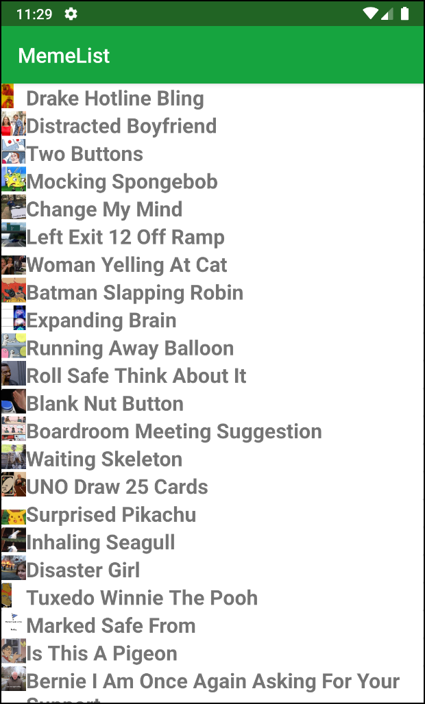

# MemeList

A Kotlin-based Android app  

## Key Components

- See [build.gradle](build.gradle) for dependencies
- UI/UX
  - RecylerView
  - CardView
  - Material Design
- Infrastructure
  - [Retrofit](https://square.github.io/retrofit/) for API orchestration
    - Using the [Imageflip API](https://api.imgflip.com/) and its [get_memes endpoint](https://api.imgflip.com/get_memes)
  - [Glide](https://github.com/bumptech/glide) for setting up the Meme image thumbnails

## Notes

- This is an experimental app that serves as my learning sandbox for Android Development with Kotlin
- I plan on interating on it with industry best practices and trends
